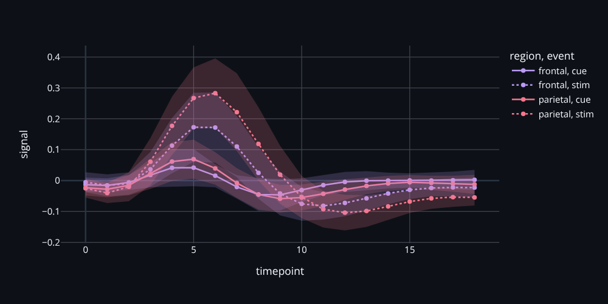
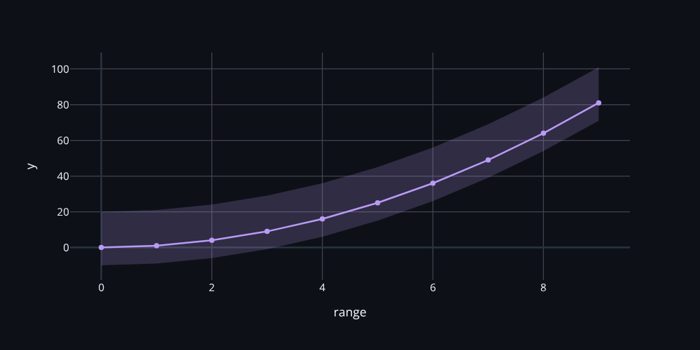
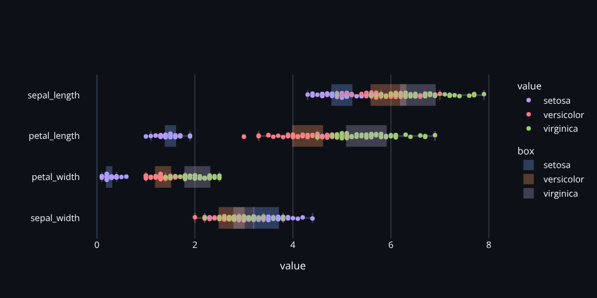
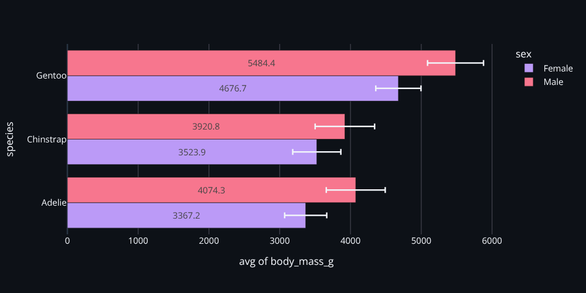

# ttplot

**ttplot** (Table to Plot) turns SQL queries into charts by annotating column roles.

Most plotting libraries make you start from the chart type: *"I want a line chart"*, then you figure out which data fits. **ttplot** flips this around. You start with a table just like you do in analysis, and assign roles to columns directly in your SQL query. The chart follows naturally from the data.

Write SQL. Annotate columns. Get a figure (e.g. from `plotly`, `matplotlib`...).

## Quick Example

```python
from ttplot import plot
from duckdb import register
import seaborn as sns

register("fmri", sns.load_dataset("fmri"))

plot("""
    FROM fmri SELECT
        timepoint,   --x
        signal,      --line
        region,      --color
        event,       --style
    ORDER BY timepoint
""")
```

<p align="center"></p>

That's it. `timepoint` becomes the x-axis, `signal` is drawn as a line, split by `region` as color and `event` as line style. No API to memorize, just tag your columns.

## Installation

```
pip install ttplot
```


## More Examples

**Error bands with computed columns:**

```python
plot("""
    FROM range(10)
    SELECT
        range,           --x
        y: range^2,      --line error=[lo hi]
        lo: y - 10,
        hi: y + 20
""")
```
<p align="center"></p>

**Layering multiple chart types:**

```python
register("iris", sns.load_dataset("iris"))

plot("""
    WITH long_form AS (
        UNPIVOT iris
        ON sepal_width, petal_width, petal_length, sepal_length
        INTO NAME measurement VALUE value
    )
    FROM long_form SELECT
        species,      --color
        measurement,  --x
        value,        --strip horizontal
        box: value,   --box horizontal alpha=0.3
""")
```
<p align="center"></p>

**Grouped bars with labels:**

```python
register("penguins", sns.load_dataset("penguins"))

plot("""
    FROM penguins SELECT
        species,      --x
        body_mass_g,  --bar grouped horizontal label format='.1f'
        sex,          --color
    GROUP BY ALL
""")
```
<p align="center"></p>


## Supported Chart Types

| Family | Types |
|---|---|
| **XY** | `line`, `scatter`, `bar`, `area`, `point`, `heatmap`, `resid` |
| **1D** | `hist`, `count`, `ecdf`, `rug`, `density`, `box`, `violin`, `strip` |
| **Polar** | `line polar`, `scatter polar`, `bar polar` |
| **3D** | `line 3d`, `scatter 3d` |
| **Hierarchical** | `treemap`, `sunburst`, `icicle` |
| **Other** | `pie`, `funnel` |
